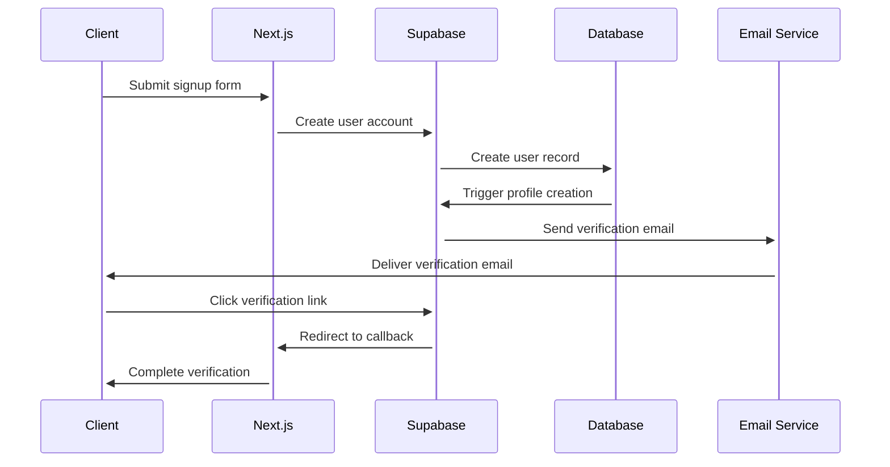
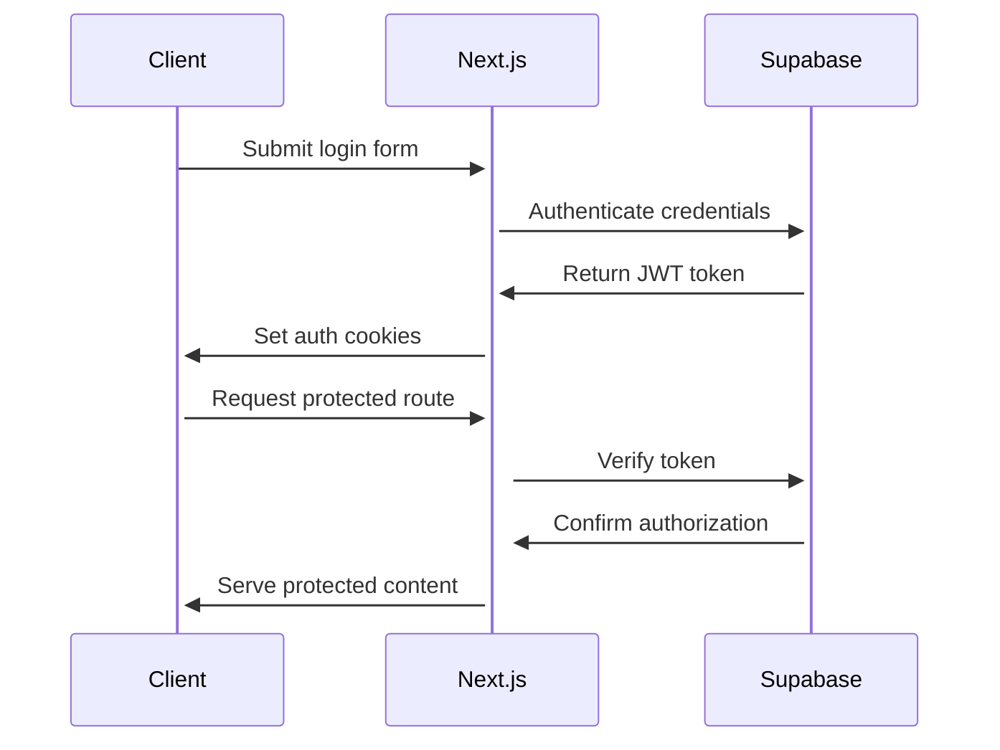
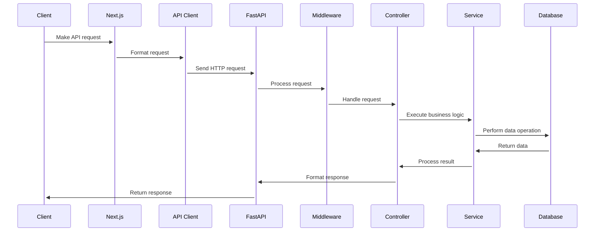
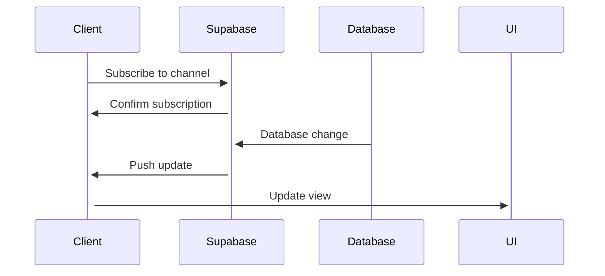
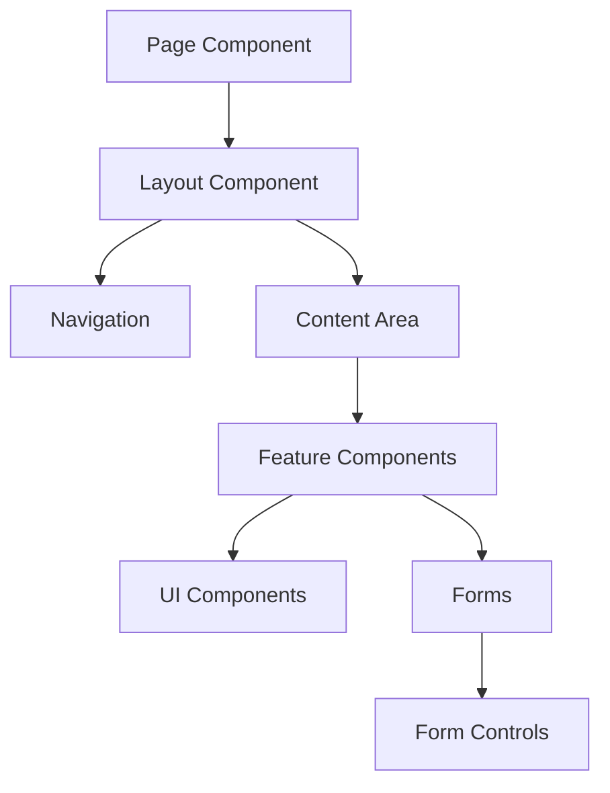
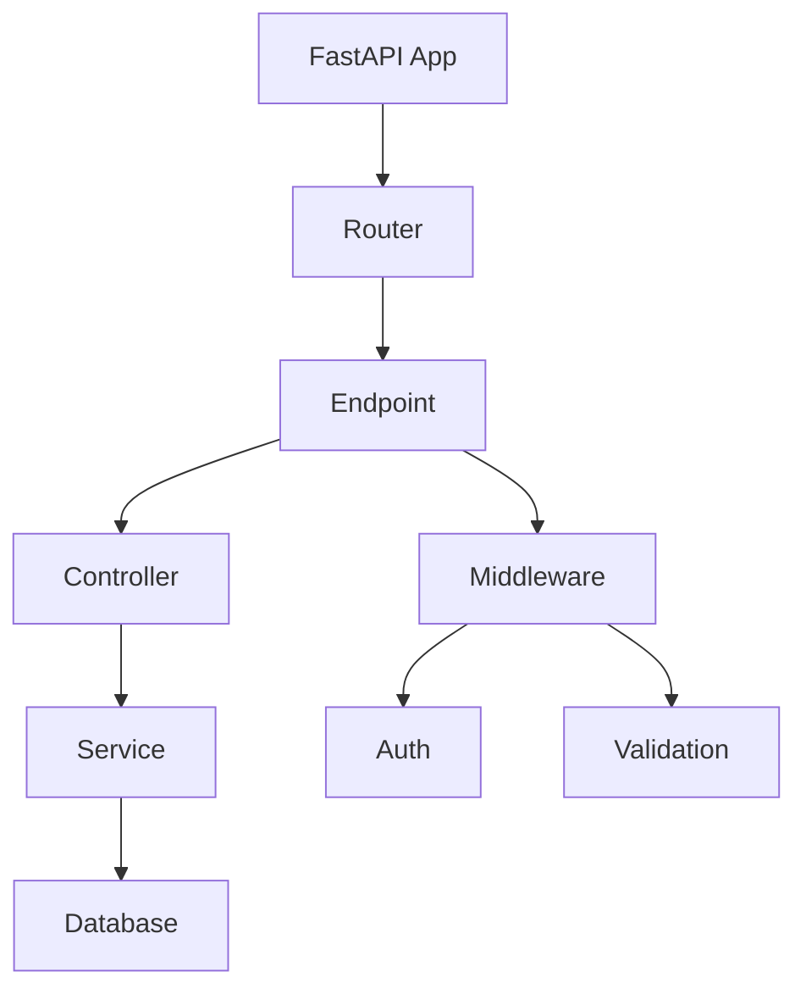

# Request Lifecycle and System Flow

## Overview
This document describes the lifecycle of a request through the system, from client initiation to response delivery.

## Authentication Flow

### 1. Sign Up Process

### 2. Sign In Process

## API Request Flow

### 1. Frontend to Backend

### 2. Real-time Updates

## Component Interaction

### 1. Frontend Components

### 2. Backend Components

## Data Flow

### 1. Write Operation
1. Client submits data
2. Frontend validation
3. API request formatting
4. Backend validation
5. Business logic processing
6. Database operation
7. Response formatting
8. Client update
9. Real-time notification

### 2. Read Operation
1. Client requests data
2. Cache check
3. API request
4. Authorization check
5. Data retrieval
6. Response formatting
7. Client rendering

## Error Handling

### 1. Client-side Errors
- Form validation
- Type checking
- Network error handling
- Retry logic
- User feedback

### 2. Server-side Errors
- Input validation
- Business rule validation
- Database error handling
- External service errors
- Error logging

## Performance Considerations

### 1. Frontend
- Component lazy loading
- Image optimization
- Bundle size management
- Caching strategy
- State management

### 2. Backend
- Database query optimization
- Connection pooling
- Caching layer
- Rate limiting
- Resource scaling

## Monitoring Points

### 1. Application Health
- API endpoint health
- Database connectivity
- External service status
- Error rates
- Response times

### 2. User Experience
- Page load times
- API response times
- Real-time latency
- Error rates
- User engagement metrics 